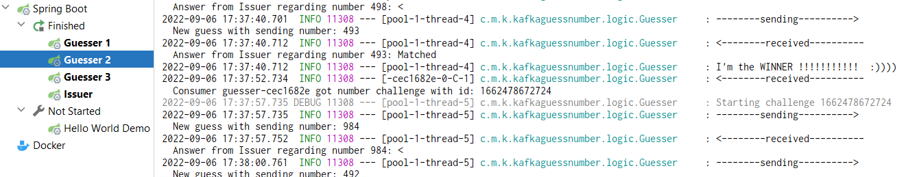
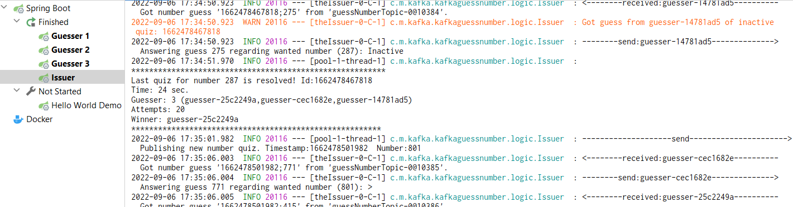
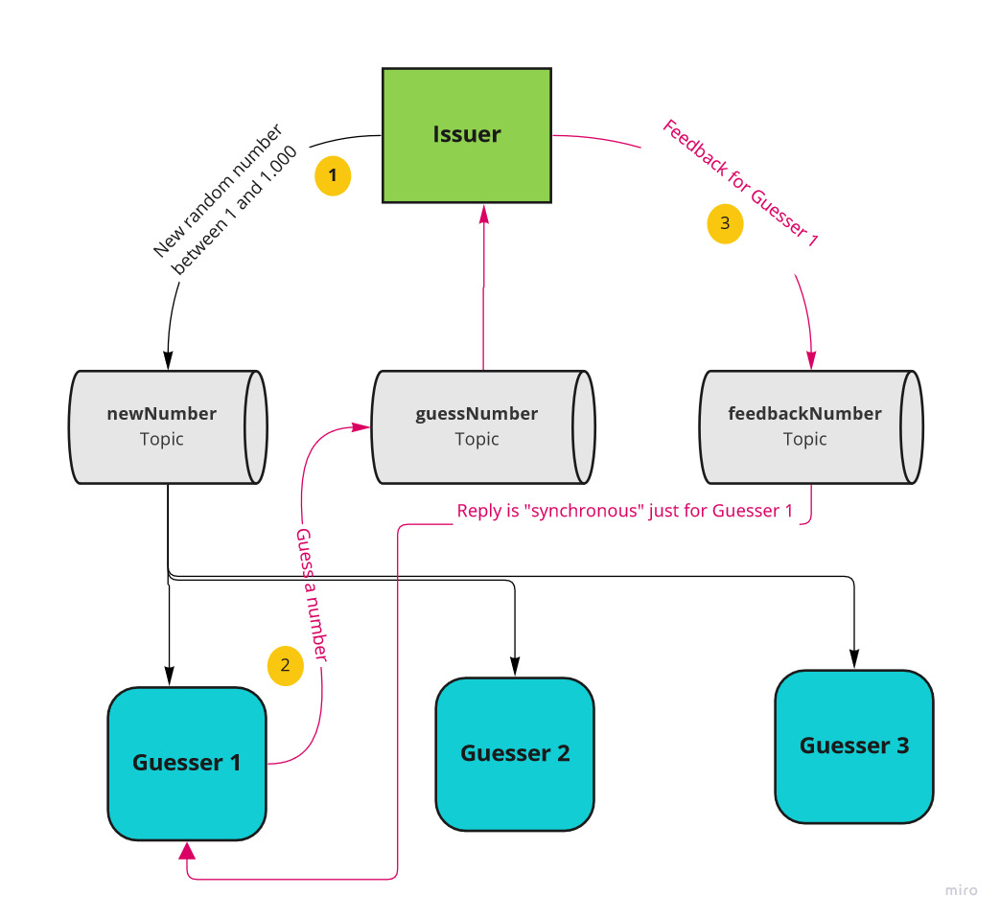

# Guess my number with Kafka

### Intro

This is a small **Java Spring Boot** application **demonstration how to use Kafka** in your applications. 
The Kafka broker is set up for local development by using corresponding **docker containers**.

This application implements the **"Guess my number" game**. 
Clients are in competition to find the number as quick as possible. Communication is done via Kafka events/topics.

### Setup Docker/Kafka

 * Make sure you have **installed Docker**; e.g. install Docker Desktop: https://www.docker.com/products/docker-desktop/
 * **Start the Docker containers** for *Zookeeper* and *Kafka*  by going in the folder `./docker` and starting `docker compose up -d` 
   * (For redundancy two containers are started for each service (2x Zookeeper + 2x Kafka)) --> commented out per default 
   * Background information regarding Docker and Kafka can be found here: [kafka-docker-setup](https://www.baeldung.com/ops/kafka-docker-setup)
   * Test access to the Kafka container. For example using the *Big Data Tools* from IntelliJ connecting to `localhost:29092`
   * Test that Zookeeper is running on `port 22181`; e.g. use another IntelliJ Plugin like *zoolytic*

### Hello-World application

Just run the application without arguments. It publishes five events to the `demoTopic` and a consumer is logging those events into the console.


### Optional: Inside Kafka - Check topics  (using Kafka tools inside the docker-container)

 * List all topics: ```kafka-topics --bootstrap-server kafka-1:9092 --list```
 * Delete a topic: ```kafka-topics --bootstrap-server kafka-1:9092 --delete --topic name```
 * Show config of special topics:  ```kafka-topics --bootstrap-server kafka-1:9092 --describe --topics-with-overrides```
 * Read/ Replay / list events of the `demoTopic`:  ```kafka-console-consumer --bootstrap-server kafka-1:9092 --topic demoTopic --from-beginning```
 * Delete topic (events): ```kafka-topics --bootstrap-server kafka-1:9092 --delete --topic demoTopic```
 * Write events to a topic: ```kafka-console-producer --bootstrap-server kafka-1:9092 --topic guessNumberTopic```
 * Read events from a topic: ```kafka-console-consumer --bootstrap-server kafka-1:9092 --topic feedbackNumberTopic```


## Run GuessNumber application


 1. Run one _NumberIssuer-App_. There should be just one instance. 
    It is responsible for publishing a random number and evaluating the answers of the _Guessers_. Class
    ```com.mos.kafka.kafkaguessnumber.KafkaGuessNumberApplication``` in profile ```numberIssuer```
    
2.  Run as many _NumberGuesser_ instances as you like. Each of them is guessing the number. 
    The feedback of the _Issuer_ would be: `<`, `>`, `Matched` or `Inactive`. 
    Start the same main class `KafkaGuessNumberApplication` with the profile `numberGuesser`

The _Issuer_ and _Guesser_ are communication via Kafka topics (see also next section). 
Notice the logs that show you what's going on and which Guesser instance is winning a challenge. 

__Guesser log:__

__Issuer log:__



### How it works

The _Issuer_ and _Guessers_ are communicating by using three different topics.
The following diagramm summarizes the architecture:




Check also class [GlobalDefs](src/main/java/com/mos/kafka/kafkaguessnumber/config/GlobalDefs.java) for global definitions.